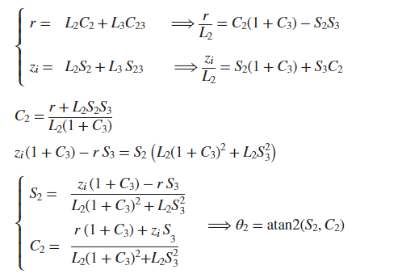

# Laboratorio 5 - Cinemática Inversa - Robot Phantom X - ROS

> ## Integrantes
> 
> - [Camilo Andrés Borda Gil](https://github.com/Canborda) (caabordagi@unal.edu.co)
> - [Paula Sofía Medina Diaz](https://github.com/psmedinadi22) (psmedinadi@unal.edu.co)
> - Robinson Jair Orduxz Gomez (rjorduzg@unal.edu.co)

---
# Cinemática inversa
Para desarrollar la cinemática inversa del Pincher se usa como refenrencia la siguiente imagen

<p align="center"></p>

Conociendo las coordenadas de los puntos a los que queremos llevar el manipulador del robot (x,y,z) y usando el metodo geometrico tenemos que para la articulación 1:
<p align="center"></p>

Para este mecanismo se tiene 2 posibles configuraciones para las articulaciones 2 y 3, codo arriba y codo abajo. Para la articulacion 3 se tiene que:
<p align="center"></p>

Con la articulacion 2 se plantea sus soluciones en función de las coordenadas y la articulacion 3.
<p align="center"></p>

Como se requiere que el herramienta sea perpendicular al plano de trabajo, para la articulacion 4 se tiene que:
<p align="center"></p>

Para la obtencion de las rutinas solicitadas se elaboro un boceto en fusion 360. Con este boceto se obtuvieron las coordenadas X y Y que conforman las trayectorias de la mayoria de las rutinas, pues para el circulo se utilizo un despeje algebraico y se tomaron puntos cada 5°.

Con las formulas obtenidas en la seccion de cinemtica inversa y las coordenadas de los puntos que se requieren para cada trayectoria se construye un excel para determinar el valor de cada articulación como se muestra en la siguiente imagen.
<p align="center"></p>

---
# Script en Python

Una vez se obtienen los valores articulares se procede a generar una matriz nx5 con la sintaxis requerida por python, esta matriz se copia al script Datos.py y se genera una función que acceda al vector requerido dentro de la matriz, a continuación se muestra la logica de programación descrita


```
import math
cargar=[[-1.57,0,0,0,0],
        [-1.57,1.57,0,0,0],
        [-1.57,1.57,0,0,1],
        [-1.57,1,0,0,1],
        [0,0,0,0,1]]

def F_carga(i):     
    return (cargar[i][0],cargar[i][1],cargar[i][2],cargar[i][3],cargar[i][4])

```


El script consiste en un case que relaciona las diferentes rutinas con los numeros enunciados en el menú, al pulsar la tecla indicada se incia un lector de tiempo que cuantifica el tiempo de ejecución de la rutina, posteriormente inicia un ciclo for en el cual se genera comunicación mediante ROS con las articulaciones que componen el robot, a cada una se le envia un valor que se obtiene al llamar las funciones creadas en el script datos.py, a demás de esto, el valor articular es convertido de radianes a grados y mostrado en pantalla junto al nombre de la rutina que se está ejecutando, también se implementa un condicional que lee el valor de la última articulación y según el rango en el que se encunetre determina si el gripper se encuentra abierto o cerrado. Una vez recorrida la matriz con todos los puntos se finaliza el ciclo for, se informa al usuario que la rutina ha finalizado y se calcula e indica el tiempo de ejecución a partir de la diferencia entre el momento de inicio y fin

```
   if key == '2': ##CARGA HERRAMIENTA 
            inicio2 = time.time()
            for i in range(0,5,1):
                    
                    state = JointTrajectory()
                    state.header.stamp = rospy.Time.now()
                    state.joint_names = ["joint_1", "joint_2","joint_3", "joint_4", "tool"]
                    point = JointTrajectoryPoint()
                    point.positions = datos.F_carga(i) 
                    point.time_from_start = rospy.Duration(0.4)
                    state.points.append(point)
                    pub.publish(state)
                    print(f"Pose: {round(math.degrees(point.positions[0]),2)}, {round(math.degrees(point.positions[1]),2)},        
                    {round(math.degrees(point.positions[2]),2)}, {round(math.degrees(point.positions[3]),2)},
                    {round(math.degrees(point.positions[4]),2)}  Rutina: Carga de herramienta " )
                    
                    if point.positions[4] > 0.9:
                        print("Herramienta cargada")
                    else:
                        print("Herramienta descargada")
                    rospy.sleep(3)
            print("Rutina < Carga de herramienta > Finalizada")
            fin2 = time.time()
            print(f"Tiempo de ejecución de rutina {fin2-inicio2} s")        
```

---
# ROS

Para la ejecución del codigó es necesario clonar el repositorio de Felipe Gonzalez dynamixel_one_motor, siguiendo las instrucciones de instalación y verificación, enseguida se procede a clonar los scripts CP_Lab5.py y datos.py en la carpeta scrips de ese repositorio. Una vez realizada la instalación de paquetes se puede ejecutar el código mediante los siguientes comandos:

```
roslaunch dynamixel_one_motor one_controller.launch
```

En una nueva terminal:
```
python3 Lab5.py
```

Una vez ejecutado el comando see desplegará el siguiente menú:
<p align="center"></p>


---
# Resultados

El brazo se desplaza a la base porta herramienta, sujeta el marcador y se ubica en una posición de espera.

https://github.com/psmedinadi22/Robotica-LAB5/assets/64180738/6b4379c3-754f-4e4a-9cde-18a29e316164


El brazo dibuja dos arcos que representan los limites de espacio de trabajo diestro plano sobre la superficie y regresa a una posición de espera.

https://github.com/psmedinadi22/Robotica-LAB5/assets/64180738/e94372e6-a3cf-46e5-8cd1-77856d16c7cc


---
# Conclusiones
- El uso de frameworks como ROS facilita significativamente la implementación de robots pequeños, como el Pincher utilizado en este laboratorio.
- Cuando el agarre superficial o el torque de las articulaciones no son suficientes, disminuir la velocidad de trabajo puede mejorar la estabilidad del robot.
- Trabajar en equipo facilita el aprendizaje en el desarrollo de los ejercicios, dado que se fomenta la discusión sobre lo que se está realizando y cómo hacerlo de la mejor manera posible.


---
# Referencias

- Laboratorio 5 - Cinemática Inversa - Robot Phantom X - ROS
- [https://github.com/fegonzalez7/rob_unal_clase4](https://github.com/fegonzalez7/inv_kinematics)
- Apuntes de clase, Robótica 2023-1

---
